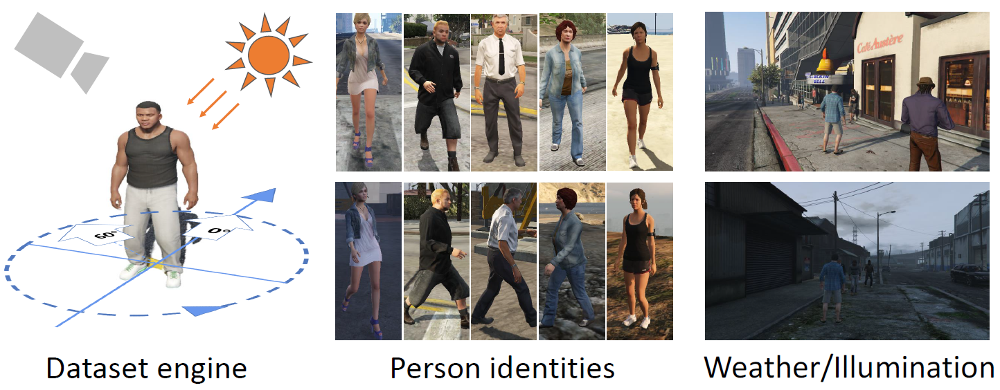

[](https://opensource.org/licenses/GPL-3.0)


# Rethinking Illumination for Person Re-Identification: A Unified View
### [Suncheng Xiang](https://JeremyXSC.github.io/)
### [Shanghai Jiao Tong University](https://en.sjtu.edu.cn/)

## Overview
In this work, we manually construct a large-scale synthetic dataset named SynPerson, which has diversified human characters and distinguished attributes with accurate annotations. Secondly, we quantitatively analyze the influence of illumination on re-ID system. To our best knowledge, this is the first attempt to explicitly dissect person re-ID from the aspect of illumination on synthetic dataset. Comprehensive experiments help us have a deeper understanding of the fundamental problems in person re-ID.

****



[**[Paper]**](https://openaccess.thecvf.com/content/CVPR2022W/VDU/papers/Xiang_Rethinking_Illumination_for_Person_Re-Identification_A_Unified_View_CVPRW_2022_paper.pdf)   [**[Video Sample]**](https://www.youtube.com/watch?v=toR_73U9yLs)   [**[Related Project]**](https://JeremyXSC.github.io/FineGPR/)   

</div> 


****

## Link of the Dataset
#### A full version of SynPerson can be downloaded from the following links:<br>
* SJTU Yun Drive: 
	* [Download Link](https://jbox.sjtu.edu.cn/l/u1fxyR) password: gehi
* Baidu Yun Drive: 
	* [Download Link](https://pan.baidu.com/s/14lEwiEP-qZ8vonyjtzqkAw) password: 38dx


## Citation
If you use our SynPerson dataset for your research, please cite our [Paper](https://openaccess.thecvf.com/content/CVPR2022W/VDU/papers/Xiang_Rethinking_Illumination_for_Person_Re-Identification_A_Unified_View_CVPRW_2022_paper.pdf).
```
@inproceedings{xiang2022rethinking,
  title={Rethinking Illumination for Person Re-Identification: A Unified View},
  author={Xiang, Suncheng and You, Guanjie and Li, Leqi and Guan, Mengyuan and Liu, Ting and Qian, Dahong and Fu, Yuzhuo},
  booktitle={Proceedings of the IEEE/CVF Conference on Computer Vision and Pattern Recognition},
  pages={4731--4739},
  year={2022}
}
```

	
## LICENSE
- The SynPerson is made available for non-commercial purposes only.
- You will not, directly or indirectly, reproduce, use, or convey the SynPerson dataset or any Content, or any work product or data derived therefrom, for commercial purposes.

Permissions of this strong copyleft license (GNU General Public License v3.0) are conditioned on making available complete source code of licensed works and modifications, which include larger works using a licensed work, under the same license. Copyright and license notices must be preserved. Contributors provide an express grant of patent rights.

****

## Acknowledgements
This work was partially supported by the National Natural Science Foundation of China under Grant No.61977045 and No.81974276.
We would like to thank authors of SynPerson dataset for their work. They provide tremendous efforts in these dataset to advance the research in this field. 

****

For further questions and suggestions about our datasets and methods, please feel free to contact Suncheng Xiang:
xiangsuncheng17@sjtu.edu.cn